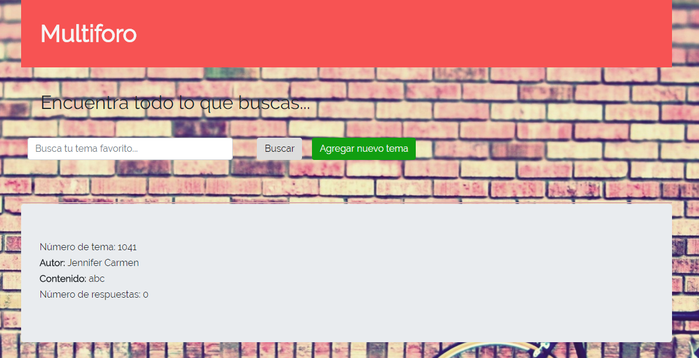

# FORO DE OPINIÓN

## Descripción
Vamos a crear un foro donde podamos crear temas y responder a esos temas.

Un tema tiene:

* Un título
* Un contador de número de respuestas
* Un autor

Una respuesta tiene:

* Un topic_id (para saber de que tema es la respuesta)
* El contenido de la respuesta
* El autor

##  Recursos utilizados

* HTML5
* CSS
* JQUERY
* Eslintrc 
* Materialize
* API 

## Autor
* Pamela Rojas
* Jymma Mogollon

## Archivos utilizados

* README.md con descripción del proyecto con la  API NY Times.
* index.html: Página web.
* .eslintrc con configuración para linter.
* .gitignore para ignorar node_modules u otras carpetas que no deban incluirse en control de versiones.
* package.json con nombre, versión, descripción, autores, licencia, dependencias, scripts (pretest, test, ...)

## Producto

## Licencia

*Copyright (C) 2018 ~ *
